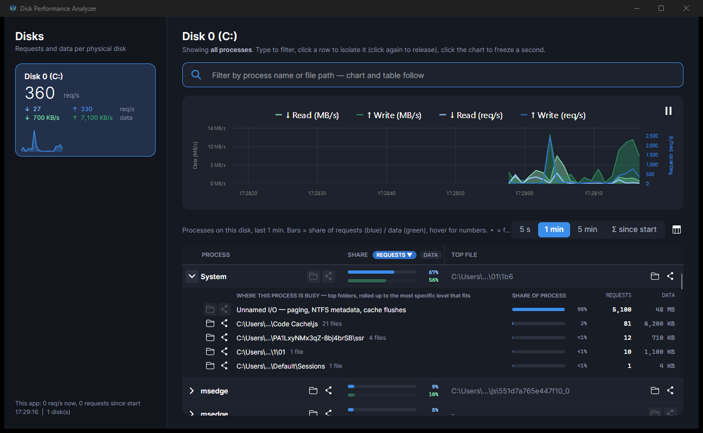
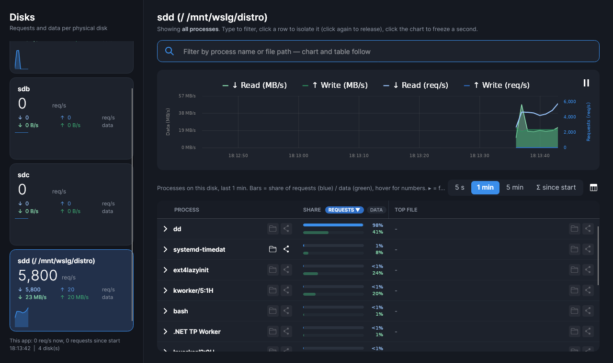

# Disk Performance Analyzer

Task-Manager-style disk *activity* monitor for Windows and Linux: see how busy each physical
disk is — **requests per second** and throughput — and which **processes and files** are
causing it. Not a capacity tool; it never counts gigabytes.



<details><summary>Linux</summary>



</details>

## Download

Grab the latest binary from the [**Releases**](../../releases/latest) page. No installer, no
.NET runtime needed (the binaries are self-contained). Every release ships a `SHA256SUMS.txt`
so you can verify the download.

**Windows 10/11 x64** — `DiskPerformanceAnalyzer-<version>-win-x64.exe`, run it. The app asks
for administrator rights on start: it reads disk I/O from an ETW kernel trace, the same source
Resource Monitor uses, and that requires elevation. SmartScreen may warn because the binary is
not code-signed — "More info → Run anyway". Optional: the settings gear (top right) can
install the exe to your user profile, add it to the Start menu and start it with Windows
(an elevated logon task, so no UAC prompt at sign-in).

**Linux x64** (glibc, X11 or Wayland) — `DiskPerformanceAnalyzer-<version>-linux-x64`:

```
chmod +x DiskPerformanceAnalyzer-<version>-linux-x64
./DiskPerformanceAnalyzer-<version>-linux-x64
```

It asks for root once via PolicyKit (`pkexec`): the per-process attribution comes from the
kernel's block tracepoints through tracefs, which is root-only. If you decline, or run it
without a PolicyKit agent, the disks are still monitored from `/proc/diskstats` — you just
get no process table. `sudo ./DiskPerformanceAnalyzer-…` works too. Linux differences: file
paths per process are the files the process holds open on that disk (the block layer does not
know which file a request belongs to), "open folder" uses `xdg-open`, and inside containers or
WSL the trace reports host PIDs, so process names come from the trace and files are not listed.

`--probe [seconds]` runs the data layer without a window and prints disks and top processes —
handy over SSH.

## What it shows

- **Per disk**: current IOPS, read/write request split, throughput, 60 s sparkline.
- **Chart (60 s)**: read/write MB/s as filled areas, read/write requests/s as lines.
  Click to freeze a second; pause icon top-right.
- **Process table**: who issued the requests in the selected window (5 s / 1 min / 5 min / since
  start). Two share bars per row — requests (blue) and data (green); the header chips pick the
  sort key, hover shows all numbers. Folder icon opens the executable or file in Explorer, share
  icon copies the path. Hidden columns (PID, read, write, requests) toggle via the column icon.
- **Folder breakdown**: expand a row (▸) to see *where* a process is busy — its I/O rolled up
  to the most specific folders that fit in seven lines, plus one line for unnamed I/O (paging,
  NTFS metadata, cache flushes). Turns "System is busy" into "System is busy in that cache folder".
- **One filter** for chart and table: type a process or path fragment, or click a row to isolate
  it in the chart (click again to release).
- Numbers never flicker: no decimals, two significant digits, tabular figures.

The tool is minimally invasive: the kernel trace is consumed in memory (no trace file), nothing
is logged to disk, and the status bar shows the app's own I/O so you can confirm it stays at zero.

## Build from source

```
dotnet build DiskPerformanceAnalyzer.sln
dotnet test  DiskPerformanceAnalyzer.sln
dotnet run --project src/DiskPerformanceAnalyzer
```

Requires the .NET 8 SDK; builds and tests on Windows and Linux. Single-file publish as done by
CI (`-r linux-x64` for the Linux binary):

```
dotnet publish src/DiskPerformanceAnalyzer -c Release -r win-x64 --self-contained -p:PublishSingleFile=true -p:IncludeNativeLibrariesForSelfExtract=true -o publish
```

## Releasing

Push a tag and CI does the rest — builds and tests on both platforms, publishes the Windows exe
and the Linux binary and creates the GitHub Release with generated notes:

```
git tag v0.2.0
git push origin v0.2.0
```

## Stack

.NET 8 · Avalonia 11 · LiveCharts2 · CommunityToolkit.Mvvm · xunit · Windows: Microsoft.Diagnostics.Tracing.TraceEvent (ETW) + PerformanceCounter · Linux: /proc/diskstats + tracefs `block:block_rq_issue`

## License

[MIT](LICENSE)
